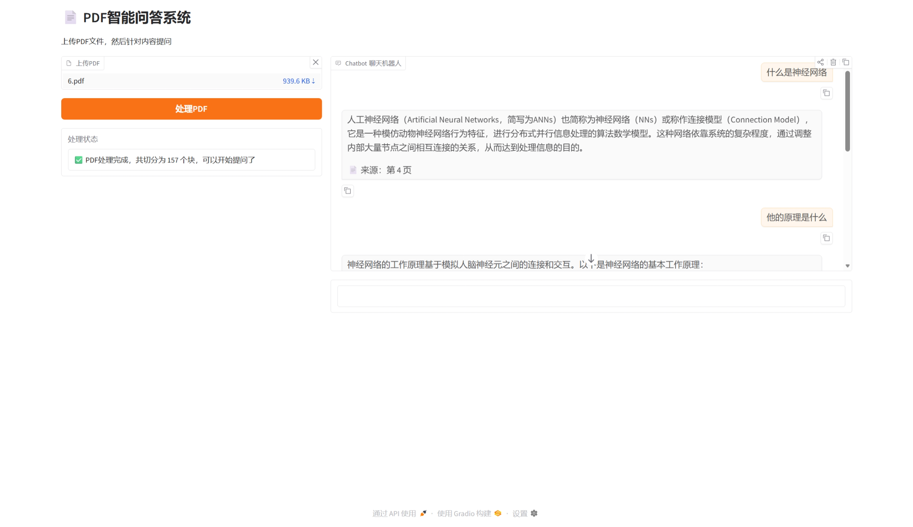

# 📄 PDF智能问答系统

基于 RAG（检索增强生成）技术的PDF文档问答系统。上传任意PDF文件，即可针对文档内容进行多轮对话问答。


## 📸 效果展示

> 上传PDF后即可开始问答，支持多轮对话，回答会标注来源页码



---

## 🛠 技术栈

| 模块 | 技术 |
|------|------|
| 后端框架 | FastAPI |
| AI编排 | LangChain |
| 向量数据库 | ChromaDB |
| Embedding模型 | 智谱 embedding-3 |
| LLM | 智谱 GLM-4-Flash |
| 前端界面 | Gradio |

## 💡 核心原理

```
PDF文件
  ↓ PyPDFLoader 加载
  ↓ RecursiveCharacterTextSplitter 切块（500字/块）
  ↓ Embedding模型向量化
  ↓ 存入 ChromaDB 向量库

用户提问
  ↓ 问题向量化
  ↓ 向量库相似度检索（Top3相关块）
  ↓ 检索结果 + 问题 → LLM
  ↓ 流式返回答案
```

## 🚀 快速开始

### 1. 克隆项目

```bash
git clone https://github.com/你的用户名/pdf-qa-system.git
cd pdf-qa-system
```

### 2. 安装依赖

```bash
pip install -r requirements.txt
```

### 3. 配置 API Key

在项目根目录新建 `.env` 文件：

```
ZHIPU_API_KEY=你的智谱API Key
```

> 智谱API Key 申请地址：https://bigmodel.cn

### 4. 启动服务

```bash
python main.py
```

启动后访问：
- **问答界面**：http://localhost:8000
- **API文档**：http://localhost:8000/docs

---

## 📡 API 接口

### 上传PDF

```
POST /upload
Content-Type: multipart/form-data

参数：file（PDF文件）

返回：
{
  "status": "success",
  "chunks": 157,
  "filename": "document.pdf"
}
```

### 问答（流式）

```
POST /chat
Content-Type: application/json

{
  "question": "这份文档的主要内容是什么？"
}

返回：SSE流式响应
data: {"delta": "这"}
data: {"delta": "份"}
...
data: [DONE]
```

---

## 📁 项目结构

```
pdf-qa-system/
├── main.py              # 应用入口，FastAPI + Gradio
├── rag/
│   ├── loader.py        # PDF加载与切块
│   └── chain.py         # 向量库构建与问答链
├── uploads/             # 上传文件存储目录
├── assets/
│   └── demo.png         # 效果截图
├── requirements.txt
├── .env                 # API Key（不上传GitHub）
└── .gitignore
```

---

## 🔧 可优化方向

- [ ] 支持多PDF同时管理
- [ ] 向量库持久化（重启不丢失）
- [ ] 回答质量优化（Rerank重排序）
- [ ] 支持Word、TXT等更多格式
- [ ] Docker一键部署
